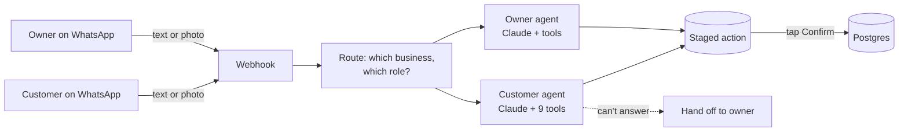
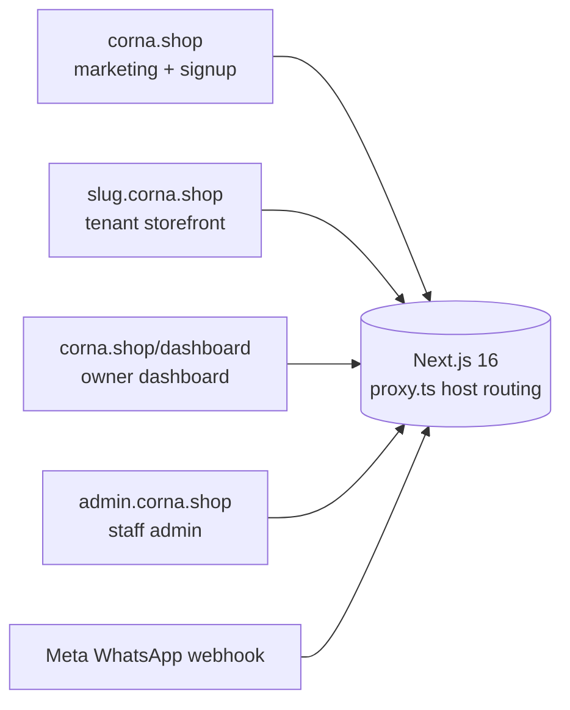
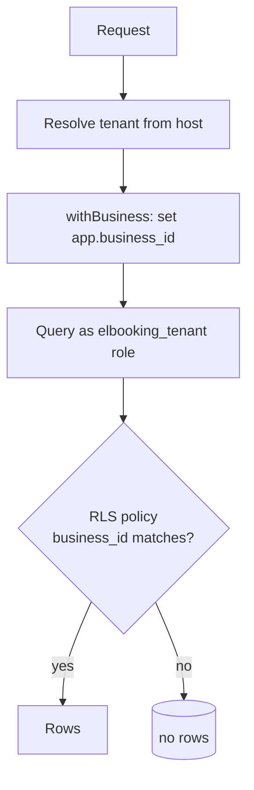
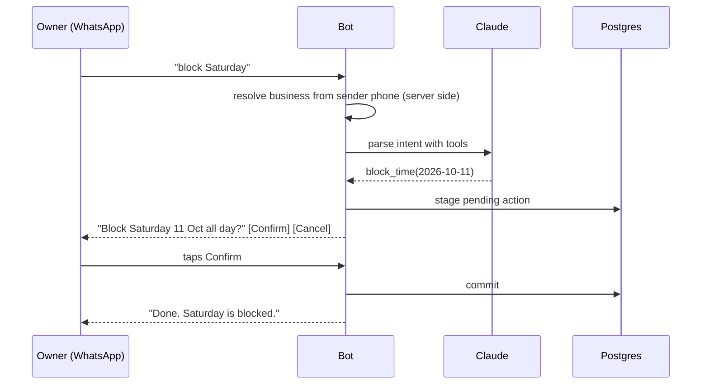

# Corna: architecture write-up

[Corna](https://corna.shop) puts two AI agents on WhatsApp for small businesses: one the owner talks to ("block Saturday", "revenue this week", "add this product" with a photo) and one their customers talk to (browse the catalog, send a photo of what they want, build a cart, place an order, book a slot). Behind them sits a multi-tenant storefront (book, gallery, shop) on each business's own subdomain. Owners never need the dashboard; the agents run the day.

This repo is a design write-up only. The product code is private. It documents how two Claude-driven agents were made safe enough to take orders and move money, and how one Next.js app serves many businesses without leaking between them.

Built solo, July to September 2026. Anthropic Claude (tool use, vision), Meta WhatsApp Cloud API, Next.js 16, Postgres, Stripe, Vercel.

## The agents, in one picture

## How the agents are built

Both agents are Claude with forced tool use. The model never writes to the database; it calls tools that **stage** an action, and a human tap commits it.

**Customer agent tools:** `get_business_info`, `browse_catalog`, `send_product_photo`, `view_cart`, `update_cart`, `place_order`, `check_availability`, `book_slot`, `ask_owner`, plus `send_store_link`. `place_order` and `book_slot` stage a pending action; the customer taps "Place order" or "Confirm booking"; only then does the shared checkout or booking path run, the same code the web storefront uses.

**Owner agent tools:** revenue and schedule reads, block time, walk-in bookings, accept or reject a booking, create a product from a photo, edit prices, mark orders paid. Every write ends in Confirm / Cancel buttons.

**Vision.** A customer sends a photo of a perfume bottle; it goes to the model as an image block alongside the catalog, and the agent matches it to a product or says it can't. An owner sends a photo with "add this, 120 dirhams"; the agent stages `product_create` with the photo attached, and Confirm creates the product and enables the shop.

**Three tiers, cheapest first.** A deterministic regex layer handles canonical commands with no model call. Claude (Haiku by default, swappable by env) handles natural language with forced tool use. If the model is unavailable, the bot degrades to the regex tier instead of going silent.

**Never a dead end.** Prompt rule nine says the agent must always hand off rather than guess. A code safety net enforces it: a photo turn that produces no tool call triggers the hand-off automatically. `ask_owner` pauses the bot for that customer for four hours, alerts the owner with a Resume button, and relays the customer's messages in the meantime.

**Guardrails that live in code, not in the prompt:**

- The model never chooses the tenant. `business_id` is resolved server-side from the sender's phone (owner) or the receiving number or a `#slug` opener (customer), then injected into every tool. The agent cannot address another business because it never sees the choice.
- Links are never pasted as text. Store and order links go out as WhatsApp `cta_url` buttons, and order URLs are re-verified against business and customer phone before sending.
- Items marked price-on-request are never priced or carted by the model.
- Deposit-taking services are refused in chat and sent to the storefront, so money for bookings only moves through the verified payment path.
- Model output is passed through a WhatsApp formatter before sending, so markdown the model emits never reaches a customer raw.

**Testing agents without a model.** `BotContext.makeAgentClient` lets tests script the model's tool calls, so the integration suite exercises every staged action and confirm path deterministically. A two-seat simulator in the dashboard (owner seat, customer seat with a synthetic number) lets a tenant try their own shop before going live.

**Memory and state.** Per (business, phone) state lives in `customer_sessions`: cart, history, name, hand-off window. Owner sessions hold pending images for two hours so a photo can be followed by instructions.

## One app, four surfaces

A single Next.js deployment routes by hostname. The `proxy.ts` layer (Next 16's renamed middleware) rewrites each request to the right surface before any page code runs.

Tenant pages live at `app/b/[slug]/` and are reached through the subdomain rewrite, so a tenant never sees a URL that isn't their own.

## Tenancy: two walls, not one

Every tenant-owned row carries `business_id`, and every query filters by it. That's the first wall, and it's a convention, so it can be broken by a bad query.

The second wall is Postgres row-level security. The app sets `app.business_id` per connection and queries through a restricted `elbooking_tenant` role whose policies only expose rows for that business. A query that forgets the filter returns nothing rather than another tenant's data.

## No double bookings, by the database

Bookings are written through exactly one function, `createBooking`. The final referee is not application code but a Postgres exclusion constraint on `(business_id, timerange)` for pending and confirmed bookings. Two requests racing for the same slot can't both win; the loser gets a constraint error, not a silent overlap. Nobody checks-then-inserts around it.

Time is stored as `timestamptz` in UTC. The business's IANA timezone applies only at render and slot generation, never as a fixed offset, so daylight-saving changes don't shift anyone's calendar.

## Money

Amounts are integer cents everywhere. Deposits and shop payments go to the owner's own rail, never through a platform balance: platform Stripe by default, or the owner's PayPal, Ziina or Tabby keys, or "collect it myself" with instructions. Payment state is verified server-to-server on return; the query string is never trusted. Refunds route by reference prefix to whichever rail took the payment.

Billing for the platform itself is a Stripe subscription with a trial → active → grace → locked ladder. A locked tenant's page and bot pause, their dashboard stays open to pay, and nothing is deleted.

## Two WhatsApp agents, one rule

The owner assistant and the customer assistant share one rule: **reads are free, every write needs a tap**. The model proposes; a human confirms with a reply button; only then does the mutation commit.

Three further decisions keep the agents inside their lane:

- **The model never chooses the tenant.** `business_id` is resolved server-side from the sender's phone (owner) or from the receiving number or a `#slug` opener (customer), then injected. The LLM cannot address another business, because it never sees the choice.
- **Deterministic first, model second.** A regex tier handles canonical commands; Claude (Haiku by default) is called with forced tool use for natural language; if the model is unavailable the bot falls back to the regex tier rather than failing.
- **Links are never pasted as text.** Store and order links go out as Cloud API `cta_url` buttons, and order URLs are re-verified against business and customer phone before sending.

Customer photos go to the model as vision input to match catalog items; if nothing matches, the bot hands off to the owner rather than guessing. "Never a dead end" is both a prompt rule and a code safety net.

## Staff admin

The admin subdomain has four roles (super admin, admin, ops, sales) and a capability matrix. Every page and every server action is gated by `requireStaff(capability)`. Staff can act on any tenant, so the audit trail matters more than the UI.

Feature flags are two-level: a platform kill switch and a per-tenant switch, effective only when both are on.

## Testing

145 tests, numbered to match the product's acceptance scenarios: slot generation across DST, booking races against the exclusion constraint, cross-tenant isolation, payment idempotency, bot confirm-before-write, and a scripted-model harness for the customer agent. Integration tests run against a real Postgres in Docker.

## What I'd do differently

- Start with the customer-facing agent. The owner bot shipped first because it was simpler, but customers are where the volume is.
- Verify third-party payment rails against live sandboxes before building the fourth one.
- Name the product before the first commit. The working name leaked into a database role.
