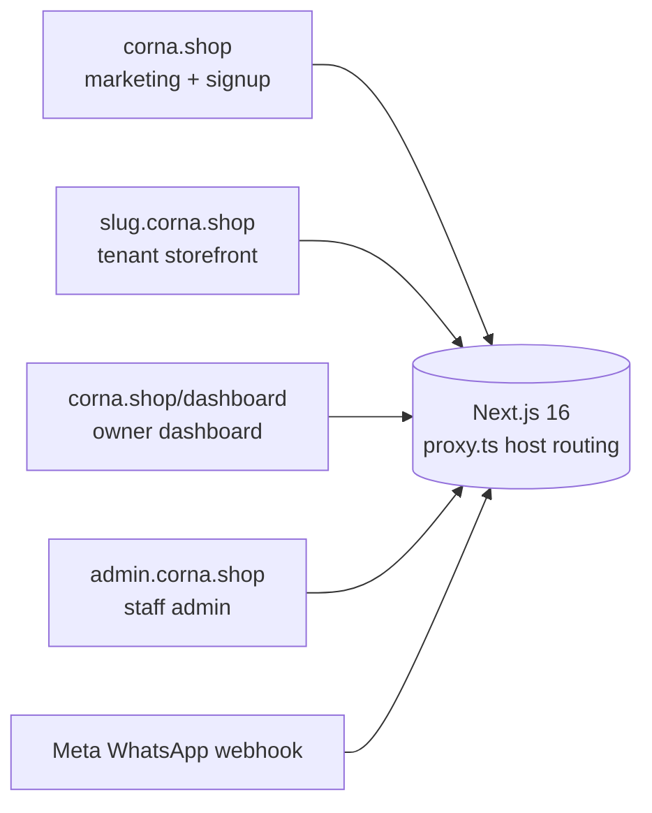
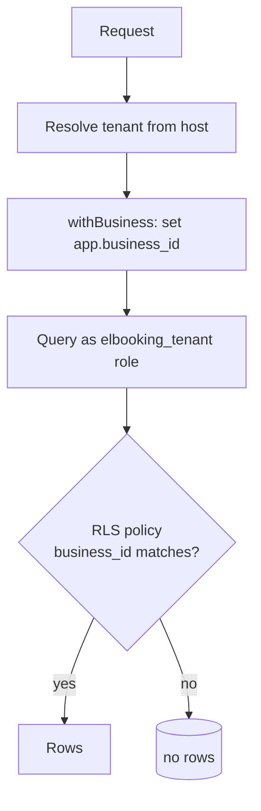
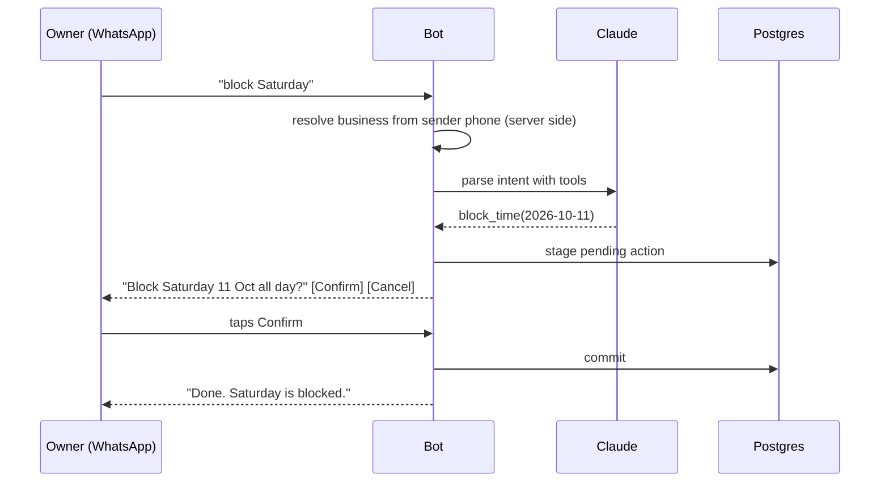

# Corna: architecture write-up

[Corna](https://corna.shop) is a multi-tenant commerce platform for small businesses that sell and take bookings over WhatsApp. Each business gets a branded storefront on its own subdomain (book, gallery, shop), a WhatsApp assistant the owner talks to, and a WhatsApp assistant its customers talk to. Owners never need the dashboard; the bot can run the day.

This repo is a design write-up only. The product code is private. It exists to document the decisions that made a single Next.js app safely serve many businesses and two LLM-driven chat agents that can move money.

Built solo, July to September 2026. Next.js 16, Postgres, Anthropic Claude, Meta WhatsApp Cloud API, Stripe, Vercel.

## One app, four surfaces

A single Next.js deployment routes by hostname. The `proxy.ts` layer (Next 16's renamed middleware) rewrites each request to the right surface before any page code runs.

Tenant pages live at `app/b/[slug]/` and are reached through the subdomain rewrite, so a tenant never sees a URL that isn't their own.

## Tenancy: two walls, not one

Every tenant-owned row carries `business_id`, and every query filters by it. That's the first wall, and it's a convention, so it can be broken by a bad query.

The second wall is Postgres row-level security. The app sets `app.business_id` per connection and queries through a restricted `elbooking_tenant` role whose policies only expose rows for that business. A query that forgets the filter returns nothing rather than another tenant's data.

## No double bookings, by the database

Bookings are written through exactly one function, `createBooking`. The final referee is not application code but a Postgres exclusion constraint on `(business_id, timerange)` for pending and confirmed bookings. Two requests racing for the same slot can't both win; the loser gets a constraint error, not a silent overlap. Nobody checks-then-inserts around it.

Time is stored as `timestamptz` in UTC. The business's IANA timezone applies only at render and slot generation, never as a fixed offset, so daylight-saving changes don't shift anyone's calendar.

## Money

Amounts are integer cents everywhere. Deposits and shop payments go to the owner's own rail, never through a platform balance: platform Stripe by default, or the owner's PayPal, Ziina or Tabby keys, or "collect it myself" with instructions. Payment state is verified server-to-server on return; the query string is never trusted. Refunds route by reference prefix to whichever rail took the payment.

Billing for the platform itself is a Stripe subscription with a trial → active → grace → locked ladder. A locked tenant's page and bot pause, their dashboard stays open to pay, and nothing is deleted.

## Two WhatsApp agents, one rule

The owner assistant and the customer assistant share one rule: **reads are free, every write needs a tap**. The model proposes; a human confirms with a reply button; only then does the mutation commit.

Three further decisions keep the agents inside their lane:

- **The model never chooses the tenant.** `business_id` is resolved server-side from the sender's phone (owner) or from the receiving number or a `#slug` opener (customer), then injected. The LLM cannot address another business, because it never sees the choice.
- **Deterministic first, model second.** A regex tier handles canonical commands; Claude (Haiku by default) is called with forced tool use for natural language; if the model is unavailable the bot falls back to the regex tier rather than failing.
- **Links are never pasted as text.** Store and order links go out as Cloud API `cta_url` buttons, and order URLs are re-verified against business and customer phone before sending.

Customer photos go to the model as vision input to match catalog items; if nothing matches, the bot hands off to the owner rather than guessing. "Never a dead end" is both a prompt rule and a code safety net.

## Staff admin

The admin subdomain has four roles (super admin, admin, ops, sales) and a capability matrix. Every page and every server action is gated by `requireStaff(capability)`. Staff can act on any tenant, so the audit trail matters more than the UI.

Feature flags are two-level: a platform kill switch and a per-tenant switch, effective only when both are on.

## Testing

145 tests, numbered to match the product's acceptance scenarios: slot generation across DST, booking races against the exclusion constraint, cross-tenant isolation, payment idempotency, bot confirm-before-write, and a scripted-model harness for the customer agent. Integration tests run against a real Postgres in Docker.

## What I'd do differently

- Start with the customer-facing agent. The owner bot shipped first because it was simpler, but customers are where the volume is.
- Verify third-party payment rails against live sandboxes before building the fourth one.
- Name the product before the first commit. The working name leaked into a database role.
